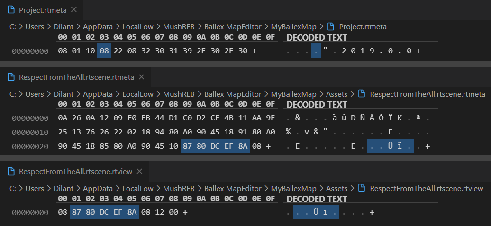

# 常见问题

## 根目录不显示

存在内部编号重复的地图，导致索引错误。

- `File → Manage Projects` 创建新项目
- 关闭 BME，找到项目文件夹：
  - Win: `%USERNAME%\AppData\LocalLow\MushREB\Ballex MapEditor\`
  - Mac: `~/Library/Application Support/com.MushREB.BallexMapEditor/`
- 将互相冲突的地图文件（`.rtscene` `.rtscene.rtmeta` `.rtscene.rtview` 三个一组）放置在不同项目中

::: danger

以下内容需要 Hex 编辑技能，没有相关经验的新手请勿尝试！

:::

::: details 治本方案

- `.rtscene.rtmeta` 倒数第 2 至 6 个字节，`.rtscene.rtview` 第 6 至 2 个字节均为地图内部编号（如上图）
- `Project.rtmeta` 倒数第 11 个字节至正数第 3 个字节为地图内部编号增量，决定了下一张新建地图的内部编号（如上图）
- 地图内部编号的每个字节均不小于 `0x80`；最小为 `0x8AEFDC8081`，最大为 `0x8FFFFBFFFF`
- 地图内部编号增量的长度可变，最高字节小于 `0x80`，其它字节均不小于 `0x80`；最小为 `0x01`，最大为 `0x05909FFFFF`
- 将地图内部编号增量 `delta` 、下一张新建地图的内部编号 `nextID` 和常数 `C = 0x8AEFDC8080` 的各个字节去除最高位，然后按 128 进制分别解释为 `delta'`、`nextID'` 和 `C' = (10, 111, 92, 0, 0)`，在 128 进制下满足数学加法 `nextID' = C' + delta'`
  例如：`delta = 0x01BB82D2AC`，`nextID = 0x8CAADED2AC`；`delta' = (1, 59, 2, 82, 44)`，`nextID = (12, 42, 94, 82, 44)`
- 使用 Hex 编辑器将不同地图的内部编号改为不同的值，并调整内部编号增量，使后续地图的内部编号不会与已完成地图相同，即可解决

:::

## 窗口无反应 / 快捷键失效

- 检查电脑输入法是否关闭 / 切换到英文。
- 刚从测图器退出时，制图器可能会无响应，最小化再最大化制图器窗口即可解决。

## 测图时天气和出生球种和设定不一样

- 朝霞、晚霞、地外、宇宙、深渊场景不支持设定天气。
- 检查关卡信息是否完整填写，图名和作者不可空缺。
- 检查是否添加了多个关卡信息，删除多余的。

## 测图卡在 85%

元件参数初始化失败。

- 尝试使用 `Edit → Fix Text` 修复文字。
- 检查带有（位姿以外的）额外参数的元件，参数是否正确设置。如果发现设置项丢失，可以删除元件后重新添加。
  - 弹跳盒
  - 文字
  - 移动路面和路点
  - 触发器
  - 可形变路面
  - 关卡信息

## 测图卡在 95%

写入文件失败。地图名不能带有特殊符号：

- Win: `\/:*?"<>|`
- Mac: `/:`；不能以 `.` 开头

## 本体测试启动 Ballex 报错连接 Steam 失败

- ~~检查是不是真没开 Steam。~~
- 在 Ballex 程序目录下创建文件 `steam_appid.txt`，内容为 `1114430`，然后再启动。

## 移动、旋转、缩放视角困难

在视野内任选一个元件，按 `F` 聚焦后继续操作。

## `V` 键无法顶点对齐

- 检查焦点是否在 Scene 窗口内，再次选中元件后继续操作。
- 检查是否处于移动元件模式下，按 `W` 切换到该模式。
- 部分元件顶点缺失（例如 B 类可形变路面），使用另一顶点对齐，或改用坐标对齐。
- 部分元件顶点过于密集导致漂移（例如风扇），改用坐标对齐。

## 向创意工坊上传地图时，在 75% 附近报错 `Generic Failure`

无法正常连接到创意工坊。以下为可供尝试的排查措施：

- 检查加速器是否冲突（例如同时开启了加速器和科学上网工具）
- 尝试手机流量热点
- 关闭所有加速工具，使用 Google DNS 或 CloudFlare DNS 直连
  - Google: `8.8.8.8`, `8.8.4.4`, `2001:4860:4860::8888`, `2001:4860:4860::8844`
  - CloudFlare: `1.1.1.1`, `1.0.0.1`, `2606:4700:4700::1111`, `2606:4700:4700::1001`

## 其他玩家找不到自己上传的地图

- 刚上传的地图需要等待一定时间（半小时左右）出现在最新列表中，可在自己的创意工坊页面确定是否成功上传。
- 确保 Steam 账户没有受限。在 Steam 中消费（购买游戏或充值钱包）不满 5 美元的账户，社区功能将会受限，详见[此处](https://support.steampowered.com/kb_article.php?ref=3330-IAGK-7663&l=simplified%20chinese)。如有需要，可以寻找其他制图者代传。
